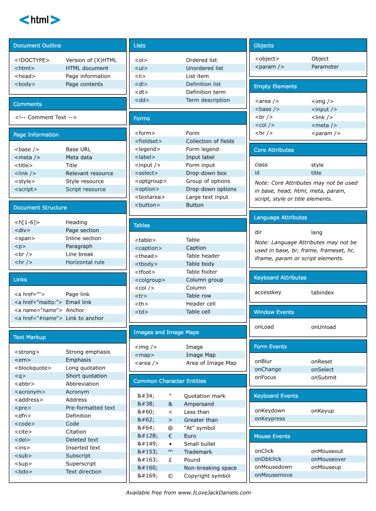

# TABLE OF CONTENTS

* [Basic HTML Elements](#Basic)
* [Formatting HTML Elements](#Formatting)

## HTML cheat sheet



## Basic

### Tag \<body>

Sample
```
<html>
<head>
  <title>Here goes the title of the document</title>
</head>
<body>
  Here goes the content of the document......
</body>
</html>
```

## Formatting
